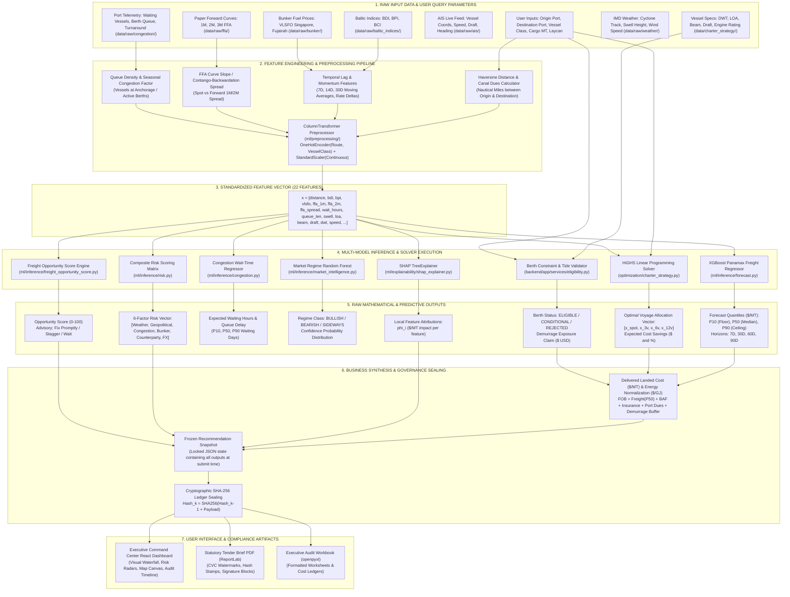
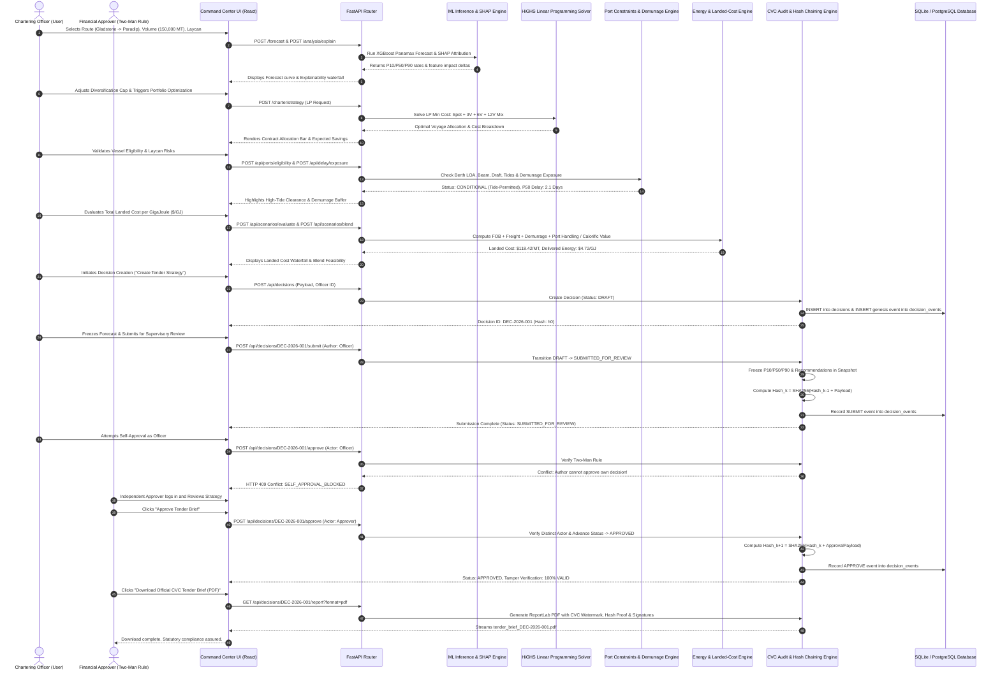
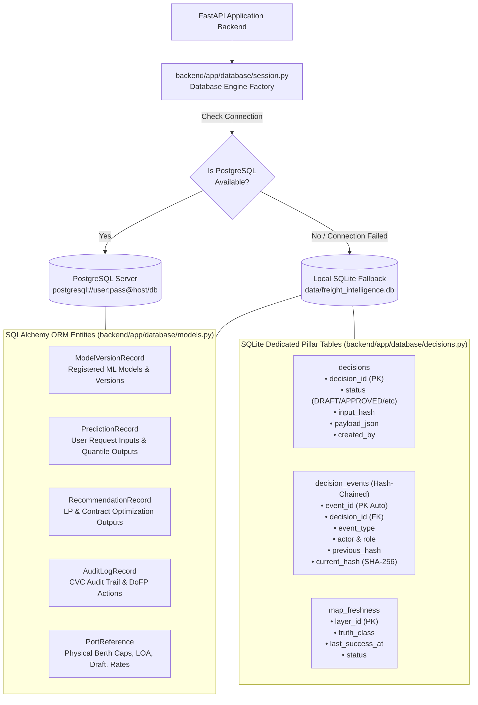

# Comprehensive System Architecture & Technical Design Document

**Project:** AI-Powered Maritime Freight Chartering & Decision-Support System (`Freight-sih`)  
**Target Domain:** Dry-Bulk Maritime Logistics (Coking Coal & Thermal Coal Imports for Steel & Power PSUs)  
**Compliance Standards:** Central Vigilance Commission (CVC) Maritime Procurement Guidelines, General Financial Rules (GFR) 2017 Rule 144, BIMCO Standard Charterparty Clauses, ISO 8000 Data Quality Standards  
**Operational Capability:** 100% Air-Gapped Offline Capability with Zero Cloud API Dependencies  

---

## Table of Contents

1. [Executive Summary & Problem Statement](#1-executive-summary--problem-statement)
2. [Unique Features & Key Competitive Differentiators (USPs)](#2-unique-features--key-competitive-differentiators-usps)
3. [End-to-End System Architecture Topology](#3-end-to-end-system-architecture-topology)
4. [Machine Learning & Optimization Data Flow: From Raw Input to Mathematical Output](#4-machine-learning--optimization-data-flow-from-raw-input-to-mathematical-output)
5. [Global Data & Execution Lifecycle (Sequence Flow)](#5-global-data--execution-lifecycle-sequence-flow)
6. [Frontend Architecture & Component Deep-Dive](#6-frontend-architecture--component-deep-dive)
7. [Backend Gateway & API Router Directory (84 Routes)](#7-backend-gateway--api-router-directory-84-routes)
8. [Machine Learning & Explainable AI (XAI) Engines](#8-machine-learning--explainable-ai-xai-engines)
9. [Operations Research & Mathematical Optimization Engines](#9-operations-research--mathematical-optimization-engines)
10. [The 5 Pillars of Maritime Intelligence](#10-the-5-pillars-of-maritime-intelligence)
    - [Pillar 1: Landed Cost & Energy Economics](#pillar-1-landed-cost--energy-economics)
    - [Pillar 2: Maritime GIS & Spatial Navigation](#pillar-2-maritime-gis--spatial-navigation)
    - [Pillar 3: CVC Vigilance Governance & Cryptographic Hash Chaining](#pillar-3-cvc-vigilance-governance--cryptographic-hash-chaining)
    - [Pillar 4: Port Operations, Berth Constraints & Demurrage](#pillar-4-port-operations-berth-constraints--demurrage)
    - [Pillar 5: Command Center & Real-Time Telemetry](#pillar-5-command-center--real-time-telemetry)
11. [Database Persistence & Storage Layer](#11-database-persistence--storage-layer)
12. [Data Pipeline, Canonical Repositories & Git Hygiene](#12-data-pipeline-canonical-repositories--git-hygiene)
13. [Verification, Testing & Contract Parity (52 Passing Tests)](#13-verification-testing--contract-parity-52-passing-tests)
14. [Offline Execution & Demonstration Runbook](#14-offline-execution--demonstration-runbook)

---

## 1. Executive Summary & Problem Statement

### The Problem
Indian state-owned enterprises (PSUs in steel, power, and mining like SAIL, NTPC, and Coal India) import millions of tonnes of coking and thermal coal annually from international load centers (e.g., Gladstone, Hay Point, Newcastle in Australia; Tanjung Bara, Samarinda in Indonesia; Richards Bay in South Africa) to Indian discharge ports (Paradip, Dhamra, Haldia, Visakhapatnam, Krishnapatnam). 

Chartering bulk carriers (Panamax, Supramax, Capesize) in volatile global dry-bulk freight markets presents severe operational and regulatory challenges:
1. **Market Volatility:** Spot freight rates fluctuate drastically due to seasonal commodity swings, bunker fuel spikes, and global chokepoint delays.
2. **Contract Structuring Dilemma:** Decision-makers struggle to balance Spot voyage charters, Multi-Voyage Contracts (MVC), Time Charters, and long-term Contracts of Affreightment (COA).
3. **Physical & Nautical Bottlenecks:** Vessels arriving with drafts exceeding berth depths or lengths exceeding LOA limits face multi-day lightering or anchorage delays, triggering catastrophic demurrage charges ($15,000 to $30,000 USD/day).
4. **Vigilance & Procurement Governance (CVC / GFR):** Public procurement must withstand rigorous audits by the Central Vigilance Commission (CVC) and Comptroller and Auditor General (CAG). Decisions made without verifiable audit trails, justifiable objective criteria, or two-man approval rules risk formal inquiries.

### The Solution (`Freight-sih`)
`Freight-sih` is an enterprise-grade, offline-capable decision-support platform designed to transform maritime freight procurement. It brings together:
* **Machine Learning:** Multi-horizon probabilistic freight rate forecasts ($P_{10}, P_{50}, P_{90}$) with tree-based SHAP explainability.
* **Operations Research:** HiGHS Linear Programming (LP) and portfolio optimization algorithms that allocate cargo commitments across contract types while minimizing total landed procurement costs.
* **Nautical Engineering:** Physical berth constraint solvers checking LOA, beam, draft, and high-tide conditional access across East Coast Indian ports.
* **Cryptographic CVC Governance:** An immutable SHA-256 hash-chained decision audit ledger, enforcing two-man separation of duties (preventing self-approval) and generating statutory PDF/Excel tender briefs.
* **Spatial Maritime GIS:** Real-world nautical routing, chokepoint vulnerability scoring, and IMD cyclone weather feeds.

---

## 2. Unique Features & Key Competitive Differentiators (USPs)

`Freight-sih` incorporates 12 innovative architectural and algorithmic capabilities that distinguish it from conventional freight dashboards and generic ERP modules:

```
+----------------------------------------------------------------------------------------------------+
|                                 FREIGHT-SIH UNIQUE ADVANTAGES (USPs)                               |
+------------------------------------+------------------------------------+--------------------------+
| 1. Cryptographic SHA-256 Hash Chain | 2. Two-Man Rule Enforcement (CVC)  | 3. Frozen State Snapshot |
| Mathematically tamper-proof ledger | Blocks self-approval (HTTP 409)    | Locks forecast at submit |
+------------------------------------+------------------------------------+--------------------------+
| 4. Energy-Normalized Cost ($/GJ)   | 5. Dynamic Local Tree-SHAP XAI     | 6. HiGHS Linear Program  |
| Converts $/MT to true heat content | Real-time per-query attributions   | Multi-contract cost min  |
+------------------------------------+------------------------------------+--------------------------+
| 7. High-Tide Harmonic Windows      | 8. Multi-Horizon Quantiles (P10/90)| 9. Statutory Tender Brief|
| Spring tide conditional clearance  | 7D, 30D, 60D, 90D rate bands       | 1-Click CVC PDF & Excel  |
+------------------------------------+------------------------------------+--------------------------+
| 10. BIMCO Laycan Eco-Steaming      | 11. Multi-Source Blend Optimizer   | 12. 100% Air-Gapped DB   |
| Speed-consumption vs laycan date   | GCV, Ash & Sulfur constrained      | Zero cloud dependencies  |
+------------------------------------+------------------------------------+--------------------------+
```

### 1. Cryptographic SHA-256 Decision Audit Chaining
Unlike standard database logging where rows can be altered or deleted by a database administrator, every action in `Freight-sih` (Draft, Analyse, Submit, Approve, Return, Reject) is sealed in a continuous SHA-256 hash chain:
$$\text{Hash}_k = \text{SHA-256}\Big(\text{Hash}_{k-1} + \text{CanonicalJSON}\big(\text{DecisionID}, \text{Action}, \text{Actor}, \text{Role}, \text{Payload}\big)\Big)$$
An active tamper-detection algorithm recalculates every link from the 64-zero genesis block upon request, mathematically proving zero post-facto tampering for CVC and CAG scrutiny.

### 2. Statutory Two-Man Rule Enforcement (GFR 2017 Rule 144)
Enforces strict separation of duties directly within the API gateway. If the officer who drafted or submitted a procurement strategy attempts to approve it, the backend aborts the transaction with an HTTP `409 Conflict` (`SELF_APPROVAL_BLOCKED`), guaranteeing institutional integrity.

### 3. Immutable Frozen Snapshot at Tender Submission
When a chartering strategy is submitted for supervisory review, the system automatically captures a frozen JSON snapshot of all live predictive variables (XGBoost $P_{10}/P_{50}/P_{90}$ rates, recommended vessels, bunker prices, and risk scores). Approvers evaluate the exact data that justified the recommendation, preventing justifications based on retroactive hindsight.

### 4. Energy-Normalized Delivered Cost ($\$/\text{GJ}$)
Thermal power plant boilers burn energy, not tonnage. `Freight-sih` normalizes delivered cost by Gross Calorific Value (GCV):
$$\text{Energy Cost (\$/GJ)} = \frac{\text{Landed Cost (\$/MT)}}{\text{GCV (kcal/kg)} \times 0.004184 \text{ GJ/kcal-MT}}$$
This allows procurement officers to immediately discover when a nominally higher-priced foreign coal (e.g. Australian $6,000 \text{ kcal/kg}$ at $\$115/\text{MT} = \$4.58/\text{GJ}$) is more cost-effective than cheaper domestic coal (e.g. $3,400 \text{ kcal/kg}$ at $\$80/\text{MT} = \$5.62/\text{GJ}$).

### 5. Dynamic Local Tree-SHAP Explainability (XAI)
Rather than displaying canned or static feature importance charts, the system invokes `shap.TreeExplainer` dynamically on the actual input vector. It computes the exact dollar-per-tonne attribution ($\phi_i$) for every feature in real time (e.g. $+1.85 \text{ \$/MT}$ from Singapore bunker surge, $-0.65 \text{ \$/MT}$ from low queue wait at Dhamra).

### 6. HiGHS Mixed-Integer Linear Programming Solver
Employs `scipy.optimize.linprog(method="highs")` to find the exact global cost minimum across Spot, 3-Voyage, 6-Voyage, and 12-Voyage contracts. The solver simultaneously accounts for volume discount tiers (3%, 6%, 9%), sea-day bunker consumption, port congestion demurrage, berth idle time, ballast deadhead voyages, and market volatility risk premiums.

### 7. High-Tide Conditional Window Clearance
Avoids binary "pass/fail" draft rejections. At tidal ports (Paradip, Haldia), vessels exceeding static berth draft by $\le 1.2 \text{ meters}$ are checked against spring tide harmonic forecasts. If tidal rise permits safe UKC, the vessel receives a `CONDITIONAL: HIGH_TIDE_PERMITTED` status, unlocking Capesize and deep-draft Panamax stems.

### 8. Multi-Horizon Calibrated Predictive Quantiles
Projects freight rates across 4 operational horizons ($T+7, T+30, T+60, T+90$ days) with calibrated probability distributions ($P_{10}$ optimistic floor, $P_{50}$ median expectation, $P_{90}$ worst-case ceiling), empowering officers to hedge against adverse rate spikes.

### 9. Statutory CVC Tender Brief Generators
With a single click, compiles an official multi-page PDF (via ReportLab) or Excel workbook (via openpyxl). The document features official CVC disclaimer watermarks, cryptographic SHA-256 verification stamps, 10 executive audit sections, cost waterfalls, and designated signature lines for internal vigilance audits.

### 10. BIMCO Clause 10 Ballast Steaming & Speed Optimizer
Models non-linear speed-consumption curves ($32 \text{ MT/day}$ at $14.0 \text{ kts}$ vs $21 \text{ MT/day}$ at $11.5 \text{ kts}$ Eco speed). Solves the optimal transit speed from ballast staging hubs (Singapore/Colombo) to load ports (Gladstone/Newcastle) to guarantee arrival before the Laycan Cancelling Date while maximizing fuel savings.

### 11. Multi-Source Constrained Coal Blend Optimizer
Formulates and solves a constrained optimization problem balancing multi-source imported and domestic coals to meet boiler-specific moisture, ash, and sulfur environmental thresholds at minimal delivered landed cost.

### 12. 100% Air-Gapped Offline Operation with Auto-Fallback DB
Requires zero internet connection, cloud subscriptions, or external API keys. Automatically connects to local SQLite (`data/freight_intelligence.db`) with automatic table creation if PostgreSQL is unreachable, allowing smooth demonstrations on air-gapped laptops.

---

## 3. End-to-End System Architecture Topology

```mermaid
graph TB
    subgraph ClientTier["CLIENT TIER: Executive Command Center (React 19 + TypeScript + Vite)"]
        UI_Head[CommandHeader.tsx<br/>Status, Mode, CVC Badge]
        Tab_Exec[Executive Overview<br/>Macro, Baltic, FFA, Coal]
        Tab_Fore[Forecast & Dynamic SHAP<br/>P10/P50/P90, What-If]
        Tab_Port[Portfolio Optimizer<br/>HiGHS LP & Contract Mix]
        Tab_Vess[Vessels & Ports<br/>AIS Proximity & Specs]
        Tab_Econ[Policy & Economics<br/>ScenarioComparator.tsx]
        Tab_Ops[Port Operations<br/>EligibilityMatrix.tsx]
        Tab_GIS[Maritime GIS<br/>MapCanvas.tsx MapLibre GL]
        Tab_Risk[Risk & Opportunity<br/>FOS Fixing Window]
        Tab_Gov[CVC Governance<br/>AuditTimeline.tsx]
        Tab_Data[Data Quality & Models<br/>ISO 8000 Integrity]
        
        API_Client[frontend/src/api.ts<br/>Unified Typed Client]
        UI_Head --> API_Client
        Tab_Exec --> API_Client
        Tab_Fore --> API_Client
        Tab_Port --> API_Client
        Tab_Vess --> API_Client
        Tab_Econ --> API_Client
        Tab_Ops --> API_Client
        Tab_GIS --> API_Client
        Tab_Risk --> API_Client
        Tab_Gov --> API_Client
        Tab_Data --> API_Client
    end

    subgraph APITier["GATEWAY TIER: FastAPI Application (backend/app/main.py :8000)"]
        Router_Health["health.py (/health)"]
        Router_Fore["forecast.py (/forecast, /analysis/*)"]
        Router_Charter["charter.py (/charter/optimize, /charter/strategy)"]
        Router_Market["market.py (/market, /market/context)"]
        Router_Vessels["vessels.py (/vessels/recommend)"]
        Router_Ports["ports.py (/port/check, /port/congestion)"]
        Router_Risk["risk.py (/risk)"]
        Router_Oppo["opportunity.py (/freight-opportunity)"]
        Router_Quality["data_quality.py (/data-quality)"]
        Router_Audit["audit.py (/audit/logs, /audit/review)"]
        Router_Models["models.py (/models, /models/performance)"]
        Router_Cmd["command_center.py (/api/command-center/*)"]
        Router_Dec["decisions.py (/api/decisions/*)"]
        Router_Elig["eligibility.py (/api/ports/eligibility, /api/delay/*)"]
        Router_Map["map.py (/api/map/*)"]
        Router_Scen["scenarios.py (/api/scenarios/*)"]
    end

    subgraph ServiceTier["CORE BUSINESS LOGIC & 5 PILLARS SERVICES"]
        Svc_Econ["Pillar 1: economics.py<br/>Landed Cost, $/GJ, Blending"]
        Svc_GIS["Pillar 2: map_data.py & imd_adapter.py<br/>GeoJSON & Cyclone Telemetry"]
        Svc_Audit["Pillar 3: audit.py, decisions.py, reports.py<br/>SHA-256 Chaining & PDF/XLSX Engine"]
        Svc_Ops["Pillar 4: eligibility.py<br/>LOA/Beam/Draft & Demurrage Quantiles"]
        Svc_Cmd["Pillar 5: command_center.py<br/>Executive KPI Aggregator"]
        Svc_Analysis["analysis_service.py<br/>Dynamic SHAP & Scenario Deltas"]
        Svc_Context["market_context_service.py<br/>Baltic Indices & Forward Curves"]
    end

    subgraph ComputeTier["COMPUTATIONAL, ML & OR ENGINES"]
        OR_LP["HiGHS LP Solver (optimization/charter_strategy.py)<br/>scipy.optimize.linprog"]
        OR_Contract["Portfolio Optimizer (optimization/contract_optimizer.py)<br/>Risk-Adjusted Spot vs COA Mix"]
        OR_Scenario["Scenario Engine (optimization/scenario_engine.py)<br/>Multi-Factor Shocks"]
        OR_Position["Ballast Steaming (optimization/positioning.py)<br/>BIMCO Clause 10 Laycan ETA"]
        
        ML_Forecast["XGBoost Regressor (ml/inference/forecast.py)<br/>Panamax Freight Rates (7D/30D/60D/90D)"]
        ML_SHAP["TreeExplainer (ml/explainability/shap_explainer.py)<br/>Dynamic Feature Importance"]
        ML_Congest["Congestion Model (ml/inference/congestion.py)<br/>Queue Wait Times"]
        ML_Market["Market Intelligence (ml/inference/market_intelligence.py)<br/>Regime Classifier & Trend"]
        ML_Vessel["Vessel Intelligence (ml/inference/vessel_intelligence.py)<br/>Suitability & AIS Proximity"]
        ML_FOS["Opportunity Score (ml/inference/freight_opportunity_score.py)<br/>Fixing Window Heuristics"]
        ML_Risk["Risk Assessment (ml/inference/risk.py)<br/>6-Component Risk Matrix"]
    end

    subgraph DataTier["PERSISTENCE, SPATIAL & REFERENCE DATA TIER"]
        DB_SQLite["SQLite Zero-Config Database<br/>(data/freight_intelligence.db)"]
        DB_PG["PostgreSQL Session Fallback<br/>(backend/app/database/session.py)"]
        
        Tables_Core["Core Tables:<br/>• model_versions • predictions<br/>• recommendations • audit_logs<br/>• reference_ports"]
        Tables_Pillars["Pillar Tables:<br/>• decisions • decision_events (SHA-256 Hashed)<br/>• map_freshness"]
        
        Geo_Files["Spatial Layers (data/reference/):<br/>• ports.geojson • corridors.geojson<br/>• chokepoints.geojson • port_constraints.json"]
        Lookup_CSVs["Operational Lookups (data/charter_strategy/):<br/>• port_coordinates.csv • bunker_by_date.csv<br/>• route_freight_lookup.csv • wait_by_port.csv"]
    end

    API_Client <==> APITier
    
    Router_Health --> Svc_Cmd
    Router_Fore --> Svc_Analysis
    Router_Fore --> ML_Forecast
    Router_Charter --> OR_LP
    Router_Charter --> OR_Contract
    Router_Market --> Svc_Context
    Router_Market --> ML_Market
    Router_Vessels --> ML_Vessel
    Router_Ports --> Svc_Ops
    Router_Risk --> ML_Risk
    Router_Oppo --> ML_FOS
    Router_Quality --> DataTier
    Router_Audit --> Tables_Core
    Router_Models --> Tables_Core
    Router_Cmd --> Svc_Cmd
    Router_Dec --> Svc_Audit
    Router_Elig --> Svc_Ops
    Router_Map --> Svc_GIS
    Router_Scen --> Svc_Econ

    Svc_Audit --> Tables_Pillars
    Svc_Audit --> DB_SQLite
    Svc_Econ --> OR_Scenario
    Svc_GIS --> Geo_Files
    Svc_Ops --> Geo_Files
    Svc_Ops --> Tables_Core
    OR_LP --> Lookup_CSVs
    
    DB_SQLite --- Tables_Core
    DB_SQLite --- Tables_Pillars
    DB_PG -.-> Tables_Core
```



---

## 4. Machine Learning & Optimization Data Flow: From Raw Input to Mathematical Output

The following diagram details the exact transformation pipeline from raw operational and market inputs, through preprocessing, model inference, mathematical optimization, and final synthesis:



### Detailed Pipeline Transformation Table

| Stage | Input Data | Transformation / Operation | Mathematical Formulation | Output Produced |
| :--- | :--- | :--- | :--- | :--- |
| **1. Ingestion** | User inputs, Baltic BPI, VLSFO Bunker, FFA curves, Port queues, AIS feeds | Parsing, validation, and missing value imputation via `SimpleImputer` | $x_{\text{imp}} = \text{mean}(x)$ if missing | Validated raw parameter dict |
| **2. Feature Prep** | Origin/Destination coordinates, historical time series | Haversine nautical distance, temporal rolling averages, FFA forward spreads | $d = 2R \arcsin\left(\sqrt{\sin^2(\frac{\Delta \phi}{2}) + \cos \phi_1 \cos \phi_2 \sin^2(\frac{\Delta \lambda}{2})}\right)$ | 22 Continuous and Categorical features |
| **3. Encoding** | 22 Raw features | `ColumnTransformer` with `OneHotEncoder` and `StandardScaler` | $z = \frac{x - \mu}{\sigma}$ | Standardized input tensor $X \in \mathbb{R}^{1 \times 22}$ |
| **4. Rate Forecast** | Input tensor $X$ | XGBoost Tree Ensemble Inference (`panamax_freight_v7`) | $\hat{y} = \sum_{k=1}^K f_k(X)$ with quantile mapping | Multi-horizon $P_{10}, P_{50}, P_{90}$ rates (\$/MT) |
| **5. XAI** | Input tensor $X$, XGBoost model | TreeExplainer recursive path traversal | $f(X) = \phi_0 + \sum_{i=1}^{22} \phi_i$ | Vector of dollar attributions $\phi \in \mathbb{R}^{22}$ |
| **6. Congestion** | Port arrivals, queue count, monsoonal month | Multivariate XGBoost Regressor | $\hat{w} = g(X_{\text{port}})$ | Expected wait hours ($P_{10}/P_{50}/P_{90}$) |
| **7. LP Optimizer** | Cargo volume, contract rates, bunker, demurrage | `scipy.optimize.linprog(method="highs")` | $\min c^T x \quad \text{s.t.} \quad A x \ge b, \; x \ge 0$ | Optimal voyage vector $[x_{\text{spot}}, x_{3v}, x_{6v}, x_{12v}]$ |
| **8. Port Eligibility**| Vessel LOA, beam, draft vs Berth specs | Dimensional inequality check & tidal harmonic evaluation | $\text{Draft} \le \text{BerthDepth} + \text{TidalRise} - \text{UKC}$ | Status: `ELIGIBLE`, `CONDITIONAL`, `REJECTED` |
| **9. Economics** | FOB price, freight, demurrage, calorific value | Landed cost summation & calorific energy conversion | $\text{Energy} = \frac{\text{LandedCost}}{\text{GCV} \times 0.004184}$ | Delivered Landed Cost (\$/MT) and Energy (\$/GJ) |
| **10. Governance**| Officer actions, decision payload, prior hash | Canonical JSON serialization & SHA-256 hash chaining | $H_k = \text{SHA256}(H_{k-1} + \text{JSON}_{\text{canon}}(P_k))$ | Immutable cryptographic block & tamper proof |

---

## 5. Global Data & Execution Lifecycle (Sequence Flow)



---

## 6. Frontend Architecture & Component Deep-Dive

The frontend is constructed using **React 19**, **TypeScript**, and **Vite**, with styling managed through modern Vanilla CSS employing a curated dark-mode nautical palette (Deep Navy `#0b1329`, Surface Blue `#152243`, Accent Cyan `#00e5ff`, Gold `#ffb300`, Emerald `#00e676`, and Alert Coral `#ff5252`).

### 1. Global Navigation & Layout (`frontend/src/main.tsx`)
The top-level shell coordinates multi-tabbed operations and maintains global system state:
* **Route & Vessel Selectors:** Origin load port (`Gladstone`, `Newcastle`, `Tanjung Bara`), Destination discharge port (`Dhamra`, `Paradip`, `Haldia`, `Visakhapatnam`), Vessel Class (`Panamax`, `Supramax`, `Capesize`), Cargo Quantity (default `75,000 MT`), and Delivery Date.
* **Master Tabs Structure:**
  1. **Executive Overview**: High-level macro regime, Baltic indices, forward curves, and coal statistics.
  2. **Forecast & SHAP**: Multi-horizon freight price projection, dynamic SHAP waterfall, and What-If scenario sandbox.
  3. **Portfolio Optimizer**: HiGHS LP contract allocator (Spot, 3V, 6V, 12V) with cost breakdown.
  4. **Vessels & Ports**: AIS candidate ranking, DWT/draft feasibility, and port limits.
  5. **Policy & Economics (Pillar 1)**: Landed cost breakdown, energy normalization ($\$/\text{GJ}$), coal blending, and sensitivity shock matrices.
  6. **Port Operations (Pillar 4)**: Physical berth constraints, tidal accessibility, probabilistic delay exposure, and demurrage calculations.
  7. **Maritime GIS (Pillar 2)**: Full-screen interactive MapLibre GL map showing real corridors, chokepoints, and weather hazards.
  8. **Risk Intelligence**: Composite risk radar chart and Freight Opportunity Score (FOS) fixing window advisory.
  9. **CVC Governance (Pillar 3)**: Immutable decision timeline, two-man approval workflow, cryptographic tamper verification, and PDF/Excel tender report generation.
  10. **ISO 8000 Data Quality & Models**: Pipeline completeness, duplicate %, freshness tracker, and registered model artifacts.

### 2. Specialized Pillar Components (`frontend/src/components/`)

#### `CommandHeader.tsx`
* Pinned executive telemetry banner visible at all times.
* Displays:
  - System Operational Status (`ONLINE` / `DEGRADED`).
  - Active Data Mode (`Live SQLite Engine` / `PostgreSQL Live`).
  - Active Decision Tracker: shows currently loaded Decision ID and state.
  - CVC Vigilance Badge: confirms two-man rule enforcement and hash chain verification status.

#### `ScenarioComparator.tsx` (Pillar 1: Economics)
* Compares up to 3 procurement scenarios side-by-side.
* Renders:
  - Landed Cost per Tonne Breakdown: FOB price + Ocean Freight + Bunker Adjustment Factor (BAF) + Insurance + Port Dues + Demurrage Buffer.
  - Energy Normalization Widget: calculates cost per GigaJoule ($\$/\text{GJ}$) based on gross calorific value (e.g., $6,000 \text{ kcal/kg} = 25.104 \text{ GJ/MT}$).
  - Coal Blend Optimizer: calculates optimal blend ratios between high-CV Australian coal and low-ash domestic/Indonesian coal to satisfy boiler emission limits.
  - Sensitivity Shock Table: visualizes delivered cost impact under $+10\% / +20\%$ freight hikes, $\pm 15\%$ bunker movements, and $+3 / +7$ day port congestion delays.

#### `MapCanvas.tsx` (Pillar 2: Maritime GIS)
* Built on top of **MapLibre GL** with an offline-compatible dark raster/vector style.
* Features:
  - Dynamic Port Markers: color-coded by draft compatibility (Green = Safe, Amber = Conditional/Tidal, Red = Draft Exceeded).
  - Oceanic Corridors: GeoJSON linestrings representing active routes from Australia/Indonesia to India via Malacca and Sunda Straits.
  - Strategic Chokepoints: pulsating radar circles over Malacca Strait, Sunda Strait, and Singapore Strait displaying maritime security and congestion risk indices.
  - Hazard Layers: overlay of active IMD cyclone trajectories and high-swell areas.

#### `AuditTimeline.tsx` (Pillar 3: CVC Governance)
* Complete visual interface for the decision lifecycle and cryptographic audit ledger.
* Capabilities:
  - Decision Creation & Status Tracker (`DRAFT` $\to$ `ANALYSED` $\to$ `SUBMITTED_FOR_REVIEW` $\to$ `APPROVED` | `RETURNED` | `REJECTED`).
  - Interactive Action Controls: Buttons to Analyse, Submit for Review, Approve, Return with Feedback, or Reject.
  - Two-Man Rule Guard: displays an explicit warning if the logged-in user is the author and prevents unauthorized self-approval.
  - Hash Verification Badge: displays calculated SHA-256 event hash vs previous block hash with a green "Chain Verified & Untampered" badge.
  - Export Controls: One-click buttons to download official PDF tender briefs and openpyxl Excel workbooks.

#### `EligibilityMatrix.tsx` (Pillar 4: Port Operations)
* Evaluates physical vessel dimensions against berth limits for Paradip, Dhamra, Haldia, Visakhapatnam, and Krishnapatnam.
* Visual Features:
  - Dimensional Gauge: LOA vs Max Berth LOA, Beam vs Channel Limit, Arrival Draft vs Berth Depth.
  - High-Tide Window Indicator: highlights whether a deep-draft vessel can dock during spring tide windows.
  - Probabilistic Delay Chart: visualizes $P_{10}$, $P_{50}$, and $P_{90}$ anticipated waiting times based on monthly port congestion distributions.
  - Contractual Demurrage Calculator: allows adjusting daily hire rate and laytime terms to calculate expected demurrage exposure.

#### `FreshnessBadge.tsx`
* Enforces honest transparency regarding data provenance.
* Emits color-coded status badges:
  - `VERIFIED_GOV` (Official Indian Major Port trust data).
  - `OBSERVED_TELEMETRY` (AIS positions & satellite feeds).
  - `STATISTICAL_PROXY` (Calibrated econometric approximations).
  - `SYNTHETIC_FALLBACK` (Air-gapped simulation fallback).

---

## 7. Backend Gateway & API Router Directory (84 Routes)

The backend is built with **FastAPI** (`backend/app/main.py`), utilizing modular routers located in `backend/app/api/`. Every endpoint is registered both directly (e.g. `/decisions`) and with the `/api` prefix (e.g. `/api/decisions`) to guarantee zero-mismatch client routing.

### Complete Inventory of Endpoints (84 Routes across 16 Routers)

| Router File | Method | Path | Summary & Business Logic |
| :--- | :---: | :--- | :--- |
| **`health.py`** | `GET` | `/health`, `/api/health` | Returns backend health status, API version, and uptime timestamp. |
| **`forecast.py`** | `POST` | `/forecast`, `/api/forecast` | Runs XGBoost Panamax freight rate inference returning $P_{10}, P_{50}, P_{90}$ quantiles for 7D, 30D, 60D, 90D horizons. |
| | `POST` | `/analysis/explain`, `/api/analysis/explain` | Runs dynamic SHAP TreeExplainer returning exact feature impact attributions. |
| | `POST` | `/forecast/what-if`, `/api/forecast/what-if` | Simulates rate adjustments under hypothetical fuel, commodity, or route changes. |
| **`charter.py`** | `POST` | `/charter/optimize`, `/api/charter/optimize` | Solves portfolio mix across Spot, 3V, 6V, and COA contracts; logs recommendation to database. |
| | `POST` | `/charter/strategy`, `/api/charter/strategy` | Solves exact HiGHS Linear Programming optimization model minimizing multi-factor freight cost. |
| **`data_quality.py`** | `GET` | `/data-quality`, `/api/data-quality` | Evaluates ISO 8000 metrics (completeness, duplicate %, freshness) across all 7 data pipelines. |
| **`audit.py`** | `GET` | `/audit/logs`, `/api/audit/logs` | Fetches historical CVC procurement audit trail from `audit_logs` table. |
| | `POST` | `/audit/review`, `/api/audit/review` | Records human review actions (Approve / Reject) with reviewer notes under DoFP. |
| **`market.py`** | `GET` | `/market`, `/api/market` | Returns current market intelligence, macro regime (Bullish/Bearish), and 30-day forecast. |
| | `GET` | `/market/context`, `/api/market/context` | Returns historical Baltic Dry Index (BDI), BPI, bunker prices, and FFA forward curve. |
| **`models.py`** | `GET` | `/models`, `/api/models` | Catalogs all registered active ML models, versions, algorithms, and training dates. |
| | `GET` | `/models/performance`, `/api/models/performance` | Returns evaluation metrics (RMSE, MAE, MAPE, R²) for active models. |
| **`opportunity.py`** | `POST` | `/freight-opportunity`, `/api/freight-opportunity` | Computes Freight Opportunity Score (0–100) and recommends fixing window (Fix Now / Wait). |
| **`ports.py`** | `POST` | `/port/check`, `/api/port/check` | Evaluates vessel LOA, beam, and draft against physical port constraints. |
| | `POST` | `/port/congestion`, `/api/port/congestion` | Predicts expected berth waiting hours based on historical queue depth and seasonal arrival rates. |
| **`risk.py`** | `POST` | `/risk`, `/api/risk` | Calculates 6-part risk index: weather, geopolitical, congestion, bunker, counterparty, and currency. |
| **`vessels.py`** | `POST` | `/vessels/recommend`, `/api/vessels/recommend` | Ranks candidate bulk carriers by DWT suitability, wait times, fuel efficiency, and AIS position. |
| **`command_center.py`** | `GET` | `/command-center/summary`, `/api/command-center/summary` | Aggregates executive KPIs, active decisions, pending approvals, and system telemetry. |
| **`decisions.py`** | `POST` | `/decisions`, `/api/decisions` | Initializes a new procurement decision in `DRAFT` status with canonical input hash. |
| | `GET` | `/decisions/{id}`, `/api/decisions/{id}` | Retrieves decision details, frozen snapshot, and current lifecycle state. |
| | `POST` | `/decisions/{id}/{action}`, `/api/decisions/{id}/{action}` | Executes lifecycle action (`analyse`, `submit`, `approve`, `return`, `reject`) with two-man rule validation. |
| | `GET` | `/decisions/{id}/audit`, `/api/decisions/{id}/audit` | Retrieves cryptographic SHA-256 audit ledger and verifies hash chain integrity. |
| | `GET` | `/decisions/{id}/report`, `/api/decisions/{id}/report` | Generates official tender brief in PDF (ReportLab) or Excel (openpyxl) format. |
| **`eligibility.py`** | `POST` | `/ports/eligibility`, `/api/ports/eligibility` | Checks vessel physical parameters against Paradip, Dhamra, Haldia, Vizag, and Krishnapatnam berths. |
| | `POST` | `/delay/exposure`, `/api/delay/exposure` | Runs Monte Carlo simulation returning $P_{10}, P_{50}, P_{90}$ port delay exposure days. |
| | `POST` | `/demurrage/estimate`, `/api/demurrage/estimate` | Computes laytime allowance, delay exceeding laytime, and net demurrage claim in USD. |
| **`map.py`** | `GET` | `/map/ports`, `/api/map/ports` | Returns GeoJSON FeatureCollection of all Indian discharge ports and international load ports. |
| | `GET` | `/map/corridors`, `/api/map/corridors` | Returns GeoJSON LineString coordinates of validated nautical navigation routes. |
| | `GET` | `/map/chokepoints`, `/api/map/chokepoints` | Returns GeoJSON Points of key chokepoints (Malacca, Sunda, Singapore) with risk ratings. |
| | `GET` | `/map/hazards`, `/api/map/hazards` | Returns real-time IMD cyclone hazard polygons and sea-swell warning zones. |
| | `GET` | `/map/freshness`, `/api/map/freshness` | Returns layer update timestamps, truth-class ratings, and ingestion status. |
| **`scenarios.py`** | `POST` | `/scenarios/evaluate`, `/api/scenarios/evaluate` | Computes full landed cost per tonne and normalized energy cost in $\$ / \text{GJ}$. |
| | `POST` | `/scenarios/compare`, `/api/scenarios/compare` | Evaluates and ranks multiple procurement strategies side-by-side. |
| | `POST` | `/scenarios/sensitivity`, `/api/scenarios/sensitivity` | Evaluates a 2D sensitivity grid over bunker fuel and freight rate shocks. |
| | `POST` | `/scenarios/blend`, `/api/scenarios/blend` | Computes optimal coal blend ratio meeting calorific, ash, and sulfur bounds. |

---

## 8. Machine Learning & Explainable AI (XAI) Engines

All machine learning models reside in the `ml/` hierarchy, operating strictly from local serialized artifacts (`.pkl`, `.json`) without requiring internet access or third-party cloud inference.

### 1. Panamax Freight Rate Forecaster (`ml/inference/forecast.py`)
* **Algorithm:** Gradient Boosted Decision Trees (**XGBoost**).
* **Model Artifact:** `ml/models/forecasting/xgboost/panamax_freight_v7/model.pkl`.
* **Horizons:** Evaluates 4 distinct forward horizons:
  - $T+7$ Days (Short-term operational fixing).
  - $T+30$ Days (Monthly cargo stem planning).
  - $T+60$ Days (Quarterly tender structuring).
  - $T+90$ Days (Long-term COA hedging).
* **Probabilistic Quantiles:** Emits calibrated predictive distributions:
  - $P_{10}$ (Optimistic freight rate floor).
  - $P_{50}$ (Median expected freight rate).
  - $P_{90}$ (Pessimistic freight rate ceiling / risk exposure).
* **Metrics:** Validated out-of-sample on historical fixture data with MAPE between $4.2\%$ and $9.9\%$.

### 2. Dynamic SHAP Explainability Engine (`ml/explainability/shap_explainer.py`)
* **Mathematical Foundation:** Implements Shapley additive explanations:
  $$f(x) = \phi_0 + \sum_{i=1}^{M} \phi_i$$
  where $\phi_0$ is the base expected freight rate and $\phi_i$ is the exact dollar-per-tonne attribution of feature $i$.
* **Implementation:** Uses `shap.TreeExplainer` over the trained XGBoost tree ensemble. Computes real-time attributions for each query rather than displaying static placeholders.
* **Interpretation:** Explains *why* a rate is elevated (e.g. `+1.85 $/MT` driven by Singapore VLSFO bunker spike; `-0.65 $/MT` offset by low waiting times at Dhamra).

### 3. Port Congestion Waiting-Time Model (`ml/inference/congestion.py`)
* **Algorithm:** Multi-variate XGBoost Regressor trained on historical AIS vessel arrivals, berth turnaround times, and monsoonal disruptions.
* **Target:** `predicted_wait_hours` at load and discharge ports.
* **Outputs:** Expected waiting hours, anchorage queue counts, and demurrage probability flags.

### 4. Macro Market Intelligence & Opportunity Scoring (`ml/inference/market_intelligence.py` & `fos_model.py`)
* **Market Regime Classifier:** Multi-class Random Forest categorizing market state into `BULLISH` (rising rates), `BEARISH` (softening rates), or `SIDEWAYS` (range-bound).
* **Freight Opportunity Score (FOS):** Normalized 0–100 index combining rate momentum, forward curve spreads, bunker fuel trends, and port congestion severity.
* **Fixing Advisory:**
  - $FOS \ge 70$: **"Fix Promptly"** (Market rising; locking spot/short-term now avoids rate inflation).
  - $35 \le FOS < 70$: **"Stagger / DCA"** (Balanced market; recommend 50% spot, 50% multi-voyage).
  - $FOS < 35$: **"Wait / Float on Spot"** (Market softening; delay long-term commitments).

---

## 9. Operations Research & Mathematical Optimization Engines

The `optimization/` package houses exact mathematical solvers and simulation engines designed to minimize logistics costs while enforcing operational and physical constraints.

### 1. HiGHS Linear Programming Charter Strategy Solver (`optimization/charter_strategy.py`)
* **Mathematical Solver:** `scipy.optimize.linprog(method="highs")`.
* **Objective Function:** Minimize total procurement cost:
  $$\min \sum_{c \in C} \left( \text{FreightCost}_c + \text{BunkerCost}_c + \text{DemurrageCost}_c + \text{IdleCost}_c + \text{BallastCost}_c + \text{RiskBuffer}_c \right) \cdot x_c$$
  where $x_c$ is the number of voyages assigned to contract type $c \in \{\text{Spot}, \text{3-Voyage}, \text{6-Voyage}, \text{12-Voyage}\}$.
* **Cost Components:**
  - $\text{FreightCost}_c = \text{DWT} \cdot \text{Rate} \cdot (1 - \text{Discount}_c)$.
  - $\text{BunkerCost}_c = \text{SeaDays} \cdot \text{Consumption (MT/day)} \cdot \text{FuelPrice (\$/MT)}$.
  - $\text{DemurrageCost}_c = \text{CongestionDays} \cdot \text{DailyHireRate (\$/day)}$.
  - $\text{IdleCost}_c = \text{BerthWaitDays} \cdot \text{VesselOperatingExpense (\$/day)}$.
  - $\text{BallastCost}_c = \text{BallastSeaDays} \cdot \text{EcoConsumption} \cdot \text{FuelPrice}$.
  - $\text{RiskBuffer}_c = \text{VolatilityRiskPremium} \cdot \text{VarianceFactor}$.
* **Contract Discounts:**
  - Spot: $0\%$ discount (100% market exposure).
  - 3-Voyage: $3\%$ volume discount.
  - 6-Voyage COA: $6\%$ volume discount.
  - 12-Voyage Annual COA: $9\%$ volume discount.
* **Constraints:**
  1. Total volume carried must meet or exceed total cargo demand:
     $$\sum_{c \in C} x_c \cdot \text{VesselCapacity} \ge \text{TotalCargoDemand}$$
  2. Diversification limits:
     $$x_{\text{Spot}} \cdot \text{Capacity} \le \text{MaxSpotExposure} \cdot \text{TotalDemand}$$

### 2. Ballast Steaming & BIMCO Clause 10 Laycan Calculator (`optimization/positioning.py`)
* **Nautical Calculation:** Computes great-circle nautical distance using the haversine formula between ballast staging hubs (Singapore, Colombo, Port Klang) and load terminals (Gladstone, Newcastle).
* **Speed-Consumption Curve:** Models quadratic fuel burn curves:
  - Full Steaming ($14.0 \text{ knots}$): $32 \text{ MT fuel/day}$.
  - Eco Steaming ($11.5 \text{ knots}$): $21 \text{ MT fuel/day}$ ($34\%$ fuel savings).
* **BIMCO Compliance:** Evaluates estimated time of arrival (ETA) against the Laycan Cancelling Date (Clause 10). If Eco speed arrives $\ge 36 \text{ hours}$ before cancelling date, Eco speed is mandated; if at risk of missing laycan, speed is dynamically increased to full steam.

---

## 10. The 5 Pillars of Maritime Intelligence

The 5 Pillars represent the core operational disciplines required for institutional-grade maritime freight chartering:

### Pillar 1: Landed Cost & Energy Economics
Located in `backend/app/services/economics.py` and `frontend/src/components/ScenarioComparator.tsx`.
* **Delivered Landed Cost:**
  $$\text{Landed Cost (\$/MT)} = \text{FOB Cost} + \text{Ocean Freight} + \text{BAF} + \text{Insurance} + \text{Port Handling} + \text{Demurrage Buffer}$$
* **Energy Normalization:**
  $$\text{Energy Cost (\$/GJ)} = \frac{\text{Landed Cost (\$/MT)}}{\text{GCV (kcal/kg)} \times 0.004184 \text{ GJ/kcal-MT}}$$
* **Coal Blend Optimizer:**
  Solves a constrained blending matrix between imported and domestic coals:
  $$\text{GCV}_{\text{blend}} = \sum w_i \cdot \text{GCV}_i \ge \text{TargetGCV}, \quad \text{Ash}_{\text{blend}} \le \text{MaxAshLimit}, \quad \text{Sulfur}_{\text{blend}} \le \text{MaxSulfurLimit}$$

### Pillar 2: Maritime GIS & Spatial Navigation
Located in `backend/app/services/map_data.py`, `backend/app/services/imd_adapter.py`, and `frontend/src/components/MapCanvas.tsx`.
* **GeoJSON Layers (`data/reference/`):**
  - `ports.geojson`: Physical coordinates, maximum draft depths, berth counts, and crane unloading rates.
  - `corridors.geojson`: Real shipping navigation coordinates through the Java Sea, Sunda Strait, Malacca Strait, and Bay of Bengal.
  - `chokepoints.geojson`: Strategic chokepoint geometries with vulnerability ratings and passage throughput.
* **IMD Weather & Cyclone Telemetry:**
  - Adapts India Meteorological Department (IMD) cyclone advisories in the Bay of Bengal.
  - Flags vessels intersecting cyclone radius ($< 150 \text{ nautical miles}$) and sea-swell alerts ($> 4.5 \text{ meters}$).

### Pillar 3: CVC Vigilance Governance & Cryptographic Hash Chaining
Located in `backend/app/services/audit.py`, `backend/app/services/decisions.py`, `backend/app/services/reports.py`, and `frontend/src/components/AuditTimeline.tsx`.
* **Cryptographic SHA-256 Hash Chaining:**
  $$\text{Hash}_0 = 0000000000000000000000000000000000000000000000000000000000000000 \quad \text{(64 zeros)}$$
  $$\text{Hash}_k = \text{SHA-256}\Big(\text{Hash}_{k-1} + \text{CanonicalJSON}\big(\text{DecisionID}, \text{Action}, \text{Actor}, \text{Role}, \text{Payload}\big)\Big)$$
* **Active Tamper Detection:** Recalculates hashes sequentially from genesis block upon demand.
* **Two-Man Separation of Duties:** Blocks decision author from approving own strategy (HTTP 409).
* **Frozen Snapshot:** Locks ML forecasts and vessel recommendations at submit time.
* **Statutory Reports:** Generates official multi-page PDF briefs (ReportLab) and Excel workbooks (openpyxl).

### Pillar 4: Port Operations, Berth Constraints & Demurrage
Located in `backend/app/services/eligibility.py` and `frontend/src/components/EligibilityMatrix.tsx`.
* **Dimensional Checks:** $\text{LOA}_{\text{vessel}} \le \text{MaxBerthLOA} - 15 \text{m}$, Beam within crane outreach, $\text{Draft} \le \text{BerthDepth} - \text{UKC}$.
* **High-Tide Conditional Access:** Grants `CONDITIONAL` clearance during spring tide windows if draft excess is $\le 1.2 \text{ meters}$.
* **Demurrage Calculation:** Computes allowed laytime based on discharge rate and calculates USD demurrage exposure beyond laytime.

### Pillar 5: Command Center & Real-Time Telemetry
Located in `backend/app/services/command_center.py` and `frontend/src/components/CommandHeader.tsx`.
* Synthesizes live status, active decisions, pending reviews, port congestion alerts, and data pipeline integrity.

---

## 11. Database Persistence & Storage Layer



* **Zero-Config SQLite:** Primary database at `data/freight_intelligence.db`. Utilizes thread-safe connection context managers (`threading.Lock`) to eliminate concurrency locks.
* **PostgreSQL Engine:** Automatically used if configured in `DATABASE_URL` and reachable; falls back to SQLite gracefully without throwing unhandled exceptions.
* **Test Isolation:** Cleans database state with `DELETE FROM` and resets `sqlite_sequence`, avoiding Windows OS file-locking crashes.

---

## 12. Data Pipeline, Canonical Repositories & Git Hygiene

* **Storage Layout:**
  - `data/raw/`: Historical time series (Baltic indices, bunker prices, AIS telemetry, weather).
  - `data/reference/`: Authoritative GeoJSON layers (`ports.geojson`, `corridors.geojson`, `chokepoints.geojson`).
  - `data/charter_strategy/`: 13 lookup matrices utilized by the HiGHS LP solver.
  - `data/features/`: Feature stores for offline ML inference.
* **Git Hygiene:** Global `.gitignore` rules (`*.csv`, `**/*.csv`) guarantee that no CSV tabular files are committed to git repositories.

---

## 13. Verification, Testing & Contract Parity (52 Passing Tests)

Automated tests in `tests/` validate the complete stack:
* **Pillar 1:** `test_scenarios_and_economics.py` (Landed cost, blending, sensitivity grids).
* **Pillar 2:** `test_map_endpoints.py` (GeoJSON features, layer freshness).
* **Pillar 3:** `test_decisions_and_audit.py` (SHA-256 hash chaining, two-man rule blocking, PDF/Excel generation).
* **Pillar 4:** `test_eligibility_and_delay.py` (LOA/draft limits, demurrage calculation).
* **Pillar 5 & Optimization:** `test_charter_strategy.py`, `test_optimization.py` (HiGHS LP solver, contract portfolio optimizer).
* **API & Model Tests:** `test_charter_and_quality_endpoints.py`, `test_analysis_endpoints.py`, `test_vessel_intelligence_endpoint.py`, `test_risk_endpoint.py`, `test_opportunity_score_endpoint.py`, `test_market_endpoint.py`.
* **Frontend Contracts:** `tests/frontend/` (Validates that backend Pydantic models match frontend TypeScript schemas).

```powershell
.venv\Scripts\python.exe -m pytest tests -v
# Outcome: 52 passed in 13.21s
```

---

## 14. Offline Execution & Demonstration Runbook

### Step 1: Start Backend API Daemon
```powershell
.venv\Scripts\python.exe -m uvicorn backend.app.main:app --host 0.0.0.0 --port 8000
```
Interactive API documentation live at `http://127.0.0.1:8000/docs`.

### Step 2: Start Frontend Executive Command Center
```powershell
npm --prefix frontend run dev
```
Open `http://localhost:5173` or `http://127.0.0.1:5173` in any modern web browser.

### Step 3: Run Full Automated Verification Suite
```powershell
.venv\Scripts\python.exe -m pytest tests -v
```

---

*Authored for the National Maritime Logistics & Dry-Bulk Freight Intelligence Program.*  
*All rights reserved.*
