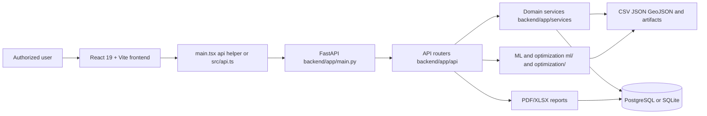
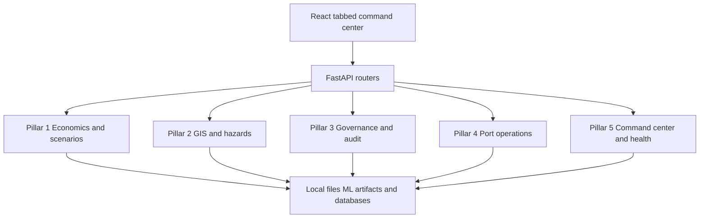
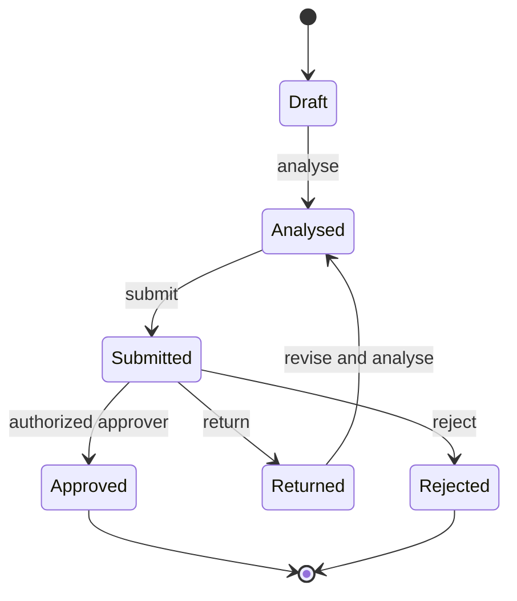

# Freight-SIH: Current System Architecture

**Project:** AI-assisted maritime freight chartering and procurement decision support  
**Domain:** Dry-bulk coal logistics for Indian steel, power, and mining PSUs  
**Document status:** Repository-aligned implementation guide  
**Last reconciled:** 2026-09-09

This document describes the code currently in this repository. It distinguishes implemented behavior from mock data, research material, legacy demo code, and future architecture. The primary implementation is the React/Vite frontend plus FastAPI/Python backend. The top-level `public/` and `api/` surface is a separate Hatchable demonstration application.

## Contents

1. [System At A Glance](#1-system-at-a-glance)
2. [Repository Structure](#2-repository-structure)
3. [Runtime And Startup](#3-runtime-and-startup)
4. [Request And Data Flow](#4-request-and-data-flow)
5. [Frontend Pages And User Workflows](#5-frontend-pages-and-user-workflows)
6. [The Five Pillars](#6-the-five-pillars)
7. [Backend API Surface](#7-backend-api-surface)
8. [Services And Computational Engines](#8-services-and-computational-engines)
9. [Libraries, Techniques, And Skills](#9-libraries-techniques-and-skills)
10. [Data, ML, And Optimization Lifecycle](#10-data-ml-and-optimization-lifecycle)
11. [Persistence And Database Behavior](#11-persistence-and-database-behavior)
12. [Testing And Verification](#12-testing-and-verification)
13. [Operational Limitations And Truth Labels](#13-operational-limitations-and-truth-labels)
14. [Architecture Diagrams](#14-architecture-diagrams)
15. [Runbook](#15-runbook)

## 1. System At A Glance

Freight-SIH is a decision-support system. It combines:

- Market intelligence and route freight context.
- Multi-horizon freight forecasting and forecast explanation.
- Contract allocation and charter strategy optimization.
- Vessel and port feasibility checks.
- Maritime map layers for ports, corridors, chokepoints, and hazard advisories.
- Scenario and landed-cost economics.
- CVC/GFR governance workflows with audit events and reports.
- Data-quality and model-registry views.

The system does not autonomously fix a vessel, award a contract, or approve a procurement decision. Human authorization remains required.

### Source of truth

For runtime behavior, use these files in this order:

1. `backend/app/main.py` and `backend/app/api/` for route registration and contracts.
2. `backend/app/services/` for business rules and service behavior.
3. `frontend/src/main.tsx`, `frontend/src/api.ts`, and `frontend/src/components/` for the user interface.
4. `ml/`, `optimization/`, `data/`, and `database/` for computation and persistence inputs.
5. `tests/` for executable expectations.

`README.md`, handoff documents, and this file are documentation layers over those sources and must be reconciled when behavior changes.

## 2. Repository Structure

```text
freight-chartering-v4/
|-- frontend/                         Active React 19 + Vite application
|   |-- src/main.tsx                   Single tabbed application shell
|   |-- src/api.ts                     Five-pillar API client
|   |-- src/components/                Map, governance, scenario, eligibility UI
|   |-- src/styles.css                 Shared application styling
|   |-- package.json                   Frontend dependencies and scripts
|   `-- vite.config.ts                Dev server and /api proxy
|-- backend/
|   |-- app/main.py                    FastAPI app and router registration
|   |-- app/api/                       HTTP route modules
|   |-- app/services/                  Domain services and business rules
|   |-- app/database/                  SQLAlchemy and governance SQLite access
|   |-- app/schemas/                   Request/response models
|   |-- app/config/                    Settings and environment configuration
|   |-- app/dependencies/              FastAPI dependency helpers
|   `-- requirements.txt               Python dependencies
|-- ml/
|   |-- inference/                     Forecast, congestion, risk, vessel, FOS logic
|   |-- explainability/                Forecast explanation helpers
|   |-- features/                      Feature construction
|   |-- preprocessing/                 Data preparation
|   |-- models/                        Serialized model artifacts
|   |-- artifacts/                     Evaluation and precomputed artifacts
|   |-- registry/model_registry.json   Active model metadata
|   `-- evaluation/                    Evaluation outputs and utilities
|-- optimization/                     OR and scenario engines
|   |-- charter_strategy.py            Charter mix and LP strategy
|   |-- contract_optimizer.py          Contract allocation
|   |-- vessel_selection.py             Vessel ranking/selection
|   |-- positioning.py                 Ballast/positioning calculations
|   `-- scenario_engine.py             Scenario shocks and comparisons
|-- data/                              Runtime data and reference inputs
|   |-- raw/                            Source-like market and operational data
|   |-- processed/                      Model-ready data
|   |-- features/                       Derived feature datasets
|   |-- reference/                      Port constraints and static references
|   |-- charter_strategy/               Freight, bunker, distance, and wait lookups
|   `-- clean/                          Cleaned datasets
|-- database/
|   |-- schema/                         PostgreSQL initialization schema
|   |-- migrations/                     SQL migration material
|   `-- seeds/                          Seed data
|-- tests/                              Backend, frontend contracts, ML, OR, pillars
|-- docs/                               Model handoffs and pillar documentation
|-- market_intelligence/                Research pipeline, reports, and notebook
|-- AI-FREIGHT/                         Research/alternate ML workspace
|-- sih/                                Supporting AIS, port, weather, and congestion files
|-- public/                             Legacy Hatchable static frontend
|-- api/                                Legacy Hatchable JavaScript endpoints
|-- lib/sim.js                          Legacy deterministic simulation logic
|-- hatchable.toml                      Legacy/demo hosting configuration
|-- docker-compose.yml                  PostgreSQL, FastAPI, and Vite services
|-- README.md                           Setup and project specification
`-- architecture_full.md                This current architecture document
```

### Important boundary: active versus legacy application

The active application is under `frontend/` and `backend/`. It is started with Vite and FastAPI. The top-level `public/index.html`, `public/app.js`, `api/*.js`, and `lib/sim.js` form a separate older Hatchable/demo surface. They are not imported by `backend/app/main.py` and do not implement the active React Maritime GIS tab.

## 3. Runtime And Startup

### Local development

Backend:

```powershell
.venv\Scripts\python.exe -m uvicorn backend.app.main:app --host 127.0.0.1 --port 8000
```

Frontend:

```powershell
npm --prefix frontend install
npm --prefix frontend run dev
```

URLs:

- Frontend: `http://127.0.0.1:5173`
- API documentation: `http://127.0.0.1:8000/docs`
- Health endpoint: `http://127.0.0.1:8000/health`

The Vite development server proxies `/api` to `http://127.0.0.1:8000` when requests use the configured proxy path. `frontend/src/api.ts` normally uses `VITE_API_BASE_URL`, which defaults to `http://127.0.0.1:8000`.

### Docker Compose

```powershell
docker compose up --build
```

The compose file defines PostgreSQL on host port `5432`, FastAPI on `8000`, and Vite on `5173`. The backend mounts `ml/` and `data/` read-only. PostgreSQL is a runtime dependency, but parts of the application can fall back to local SQLite.

## 4. Request And Data Flow

### Standard request path

```text
User action in React tab
  -> frontend/src/main.tsx or component
  -> fetch client in main.tsx or frontend/src/api.ts
  -> FastAPI route in backend/app/api/
  -> service, ML module, optimization module, file lookup, or database
  -> response schema/JSON
  -> React state update and rendered panel/table/map layer
```

There are currently two frontend API styles:

- Older tab logic in `frontend/src/main.tsx` has a local `api()` helper and mostly calls unprefixed paths such as `/forecast` and `/market`.
- The five-pillar components use `frontend/src/api.ts` and mostly call `/api/...` paths.

`backend/app/main.py` publishes the registered routers with both the direct path and the `/api` prefix. This dual publication is why both client styles work.

### Startup and eager requests

The React shell mounts the executive view and eagerly requests several health, market, model, and command-center values. Selecting a tab then activates its tab-specific component and requests. Browser network activity can therefore include requests for more than the currently visible tab.

### Map request path

```text
MapCanvas
  -> getPorts(), getCorridors(), getChokepoints(), getHazards()
  -> /api/map/*
  -> backend/app/api/map.py
  -> backend/app/services/map_data.py and imd_adapter.py
  -> wrapped GeoJSON or hazard response
  -> MapCanvas overlays
```

The basemap is separated from application data. `MapCanvas` attempts OpenFreeMap tiles, but the visible offline surface uses the bundled `world-atlas` country geometry projected through `d3-geo`; application markers/routes are drawn over it. This is the reliable local fallback when external tile requests fail.

## 5. Frontend Pages And User Workflows

There are not separate route files for each page. `frontend/src/main.tsx` is one React application with 12 state-selected tabs. The sidebar changes `activeTab`, and the matching section renders.

### 5.1 Executive Overview

Purpose: operational market snapshot and first-level chartering context.

Displays current freight, market regime, FOS signal, Baltic indices, macro signals, FFA curve, coal imports, events, fixture history, and a market-intelligence action.

Dependencies: `/market`, `/market/context`, `/health`, command-center summary values, and market/fixture data under `data/raw/`.

### 5.2 Forecast & SHAP

Purpose: route-specific freight forecast and explanation.

Users select origin, destination, vessel class, cargo, quantity, and laycan dates. The UI renders current freight, forecast bands across multiple horizons, model metadata, and SHAP-style drivers. A what-if flow compares changed assumptions.

Dependencies: `/forecast`, `/forecast/explain`, `/forecast/what-if`, forecast artifacts under `ml/models/` and `ml/artifacts/`, and processed feature data.

### 5.3 Portfolio Optimizer

Purpose: allocate cargo across spot, multi-voyage, short-term, and COA-style contract choices.

The UI collects cargo, route, vessel, risk, and planning inputs, then renders allocation, cost, savings, fixing window, constraints, and sensitivity context.

Dependencies: `/charter/optimize`, `/charter/strategy`, `optimization/contract_optimizer.py`, `optimization/charter_strategy.py`, and `data/charter_strategy/`.

### 5.4 Vessel Intelligence

Purpose: rank vessels for cargo and route fit.

The view combines vessel suitability, operational constraints, and port checks. It is decision support, not a live AIS tracking console.

Dependencies: `/vessels/recommend`, `/port/check`, vessel/AIS/reference data under `data/`, `sih/`, and ML artifacts.

### 5.5 Risk Intelligence

Purpose: expose risk components and recommendation posture.

Dependencies: `/risk`, risk artifacts under `ml/artifacts/risk_model/`, active events, and market context services.

### 5.6 Freight Opportunity

Purpose: identify whether current conditions support fixing, waiting, or monitoring.

The Freight Opportunity Score combines component scores, contributions, confidence/context, and a fixing-window recommendation.

Dependencies: `/freight-opportunity`, FOS feature data under `data/features/freight_opportunity_score/`, and FOS artifacts/inference code under `ml/`.

### 5.7 Policy & Economics

Purpose: compare landed-cost and market scenarios.

`ScenarioComparator` calls the scenarios API and renders side-by-side outcomes, sensitivity, and blend/economic results.

Dependencies: `/api/scenarios/evaluate`, `/api/scenarios/compare`, `/api/scenarios/sensitivity`, `/api/blends/evaluate`, `backend/app/services/economics.py`, and `optimization/scenario_engine.py`.

### 5.8 Port Operations

Purpose: determine vessel eligibility and quantify delay/demurrage exposure.

`EligibilityMatrix` checks LOA, beam, draft, berth constraints, and conditional access fields. Delay exposure and demurrage are operational cost signals.

Dependencies: `/api/ports/eligibility`, `/api/delay/exposure`, `/api/demurrage/estimate`, `data/reference/port_constraints.json`, and `backend/app/services/eligibility.py`.

### 5.9 Maritime GIS

Purpose: show verified static maritime reference layers and hazard-advisory context.

The view renders ports as blue points, shipping corridors as yellow lines, strategic chokepoints as orange points, and hazard advisories as red demo points when geometry is available.

The local map surface uses `world-atlas`, `topojson-client`, and `d3-geo` for country geometry. OpenFreeMap is attempted for a richer basemap but is not required for the local surface. The map supports drag panning and wheel zoom for the local surface; layer toggles control application overlays.

Dependencies: `/api/map/ports`, `/api/map/corridors`, `/api/map/chokepoints`, `/api/map/hazards`, `/api/map/freshness`, `backend/app/services/map_data.py`, and `backend/app/services/imd_adapter.py`.

### 5.10 Data Quality

Purpose: inspect configured datasets for health, row counts, missingness, duplicates, and freshness.

Dependencies: `/data-quality`, `backend/app/api/data_quality.py`, and configured local files.

### 5.11 CVC Governance

Purpose: review decision state, audit history, approval responsibility, and generated reports.

`AuditTimeline` uses decision workflow and audit endpoints. The workflow requires human review and blocks self-approval according to the implemented state rules.

Dependencies: `/api/decisions`, `/api/decisions/{id}/audit`, `/api/decisions/{id}/report?format=pdf|xlsx`, `/audit/logs`, `/audit/review`, `backend/app/services/decisions.py`, `audit.py`, and `reports.py`.

### 5.12 Model Registry

Purpose: show active model metadata, versions, status, artifacts, and available performance data.

Dependencies: `/models`, `/models/performance`, and `ml/registry/model_registry.json`.

## 6. The Five Pillars

### Pillar 1: Landed Cost, Energy Economics, And Scenarios

**Ownership:** `backend/app/services/economics.py`, `optimization/scenario_engine.py`, and `ScenarioComparator`.

This pillar translates route, cargo, bunker, freight, port, quality, and contract assumptions into comparable economics. It supports landed cost, energy-normalized cost where the endpoint contract supplies the required quality inputs, scenario comparison, sensitivity shocks, and coal blend evaluation.

**Flow:** user assumptions -> scenario/economics API -> economics service and scenario engine -> cost/risk/sensitivity/blend result -> Policy & Economics tab.

### Pillar 2: Maritime GIS, Corridors, Chokepoints, And Hazards

**Ownership:** `backend/app/api/map.py`, `backend/app/services/map_data.py`, `backend/app/services/imd_adapter.py`, and `frontend/src/components/MapCanvas.tsx`.

Static reference layers come from local data and are returned as GeoJSON. Hazard data is explicitly truth-labelled; by default the IMD adapter is demo/mock behavior unless live mode is enabled and wired. External tiles are optional; local country geometry is bundled for predictable rendering.

### Pillar 3: CVC/GFR Governance, Decisions, Audit, And Reports

**Ownership:** `backend/app/api/decisions.py`, `backend/app/services/decisions.py`, `audit.py`, `reports.py`, and `AuditTimeline`.

This pillar implements a decision state machine, action authorization, audit events, hash-chain verification, self-approval prevention, and PDF/XLSX report generation. It creates an auditable record but does not replace statutory review or authorized procurement approval.

```text
create -> analyse -> submit -> approve
                  |       |-> return -> analyse/submit
                  |       |-> reject
                  `-> audit/report at relevant stages
```

### Pillar 4: Port Operations, Eligibility, Delay, And Demurrage

**Ownership:** `backend/app/api/eligibility.py`, `backend/app/services/eligibility.py`, `data/reference/port_constraints.json`, and `EligibilityMatrix`.

This pillar checks vessel/port physical compatibility and produces operational delay exposure. Constraint behavior is driven by available reference fields. Conditional draft handling is not a universal high-tide solver for every port; it applies where the active reference data and service logic define a conditional rule.

### Pillar 5: Command Center, Health, Freshness, And Telemetry Summary

**Ownership:** `backend/app/api/command_center.py`, health routes, map freshness service, and `CommandHeader`.

This pillar aggregates service health, decision counts, pending review counts, model status, and map/data freshness values for the executive shell. It is an application summary layer, not a full streaming telemetry platform.

## 7. Backend API Surface

`backend/app/main.py` is the route registry. The application currently has 16 logical router modules and approximately 39 logical operations. Routes are mounted in both direct and `/api` forms, giving approximately 78 URL variants. This is different from the older claim of 84 routes.

| Router | Representative operations | Responsibility |
|---|---|---|
| `health.py` | `/health` | Service health and status |
| `forecast.py` | `/forecast`, `/forecast/explain`, `/forecast/what-if` | Forecast and explanation |
| `charter.py` | `/charter/optimize`, `/charter/strategy` | Charter strategy and allocation |
| `market.py` | `/market`, `/market/context` | Market regime and context |
| `vessels.py` | `/vessels/recommend` | Vessel recommendation |
| `ports.py` | `/ports`, `/port/check` | Port data and physical checks |
| `risk.py` | `/risk` | Risk assessment |
| `opportunity.py` | `/freight-opportunity` | Freight Opportunity Score |
| `data_quality.py` | `/data-quality` | Dataset quality scan |
| `audit.py` | `/audit/logs`, `/audit/review` | Recommendation/audit views |
| `models.py` | `/models`, `/models/performance` | Registry and performance |
| `command_center.py` | `/api/command-center/*` | Executive summary |
| `decisions.py` | `/api/decisions/*` | Governed decision lifecycle |
| `eligibility.py` | `/api/ports/eligibility`, `/api/delay/*`, `/api/demurrage/*` | Operations and cost exposure |
| `map.py` | `/api/map/*` | GeoJSON and hazard layers |
| `scenarios.py` | `/api/scenarios/*`, `/api/blends/evaluate` | Economics and scenarios |

The authoritative endpoint details are the route decorators and schemas in `backend/app/api/` and `backend/app/schemas/`.

## 8. Services And Computational Engines

### Backend services

- `economics.py`: landed-cost and economic calculations.
- `eligibility.py`: port/vessel constraints and delay exposure.
- `map_data.py`: static maritime GeoJSON and freshness metadata.
- `imd_adapter.py`: hazard-advisory adapter; demo by default unless live mode is configured.
- Forecasting/analysis services: forecast response construction, what-if analysis, and explanation data.
- Market context/intelligence services: indices, regimes, curves, and market signals.
- Risk services: risk factors and recommendation posture.
- `decisions.py`: governed decision lifecycle.
- `audit.py`: audit events and hash-chain operations.
- `reports.py`: PDF/XLSX report generation.

### ML and inference

The `ml/` tree contains inference, preprocessing, feature engineering, explainability helpers, model artifacts, evaluation, and registry metadata. Serialized artifacts are loaded by active inference paths; not every research notebook or artifact folder is part of the live request path.

### Optimization

The `optimization/` package contains:

- `charter_strategy.py`: charter strategy calculations and LP-facing inputs.
- `contract_optimizer.py`: contract allocation and strategy enrichment.
- `scenario_engine.py`: scenario shock/compare logic.
- `positioning.py`: positioning and ballast calculations.
- `vessel_selection.py`: vessel selection logic.

Where configured, charter optimization uses `scipy.optimize.linprog(method="highs")`. The optimizer output remains advisory and is returned through FastAPI for human review.

## 9. Libraries, Techniques, And Skills

This section records the technologies and engineering techniques used by the current implementation. A library listed here is either pinned in the active dependency manifests or directly used by the active source tree. Research-only notebooks and legacy Hatchable dependencies are not presented as active runtime dependencies.

### 9.1 Frontend libraries and web platform

Declared in `frontend/package.json`:

| Library | Role in this project |
|---|---|
| React 19 | Component model, state, effects, and the single tabbed command-center UI |
| React DOM 19 | Browser rendering through `createRoot` |
| TypeScript 5.8 | Static typing for React components, API contracts, and UI state |
| Vite 7 | Development server, module graph, proxying, and production bundling |
| `@vitejs/plugin-react` | React transform and Vite integration |
| `maplibre-gl` 6 (MapLibre GL) | Map container, controls, GeoJSON sources, vector-style support, and map interaction foundation |
| `d3-geo` | Geographic projections, paths, and graticules for the local offline basemap |
| `topojson-client` | Converts bundled TopoJSON country geometry into GeoJSON-like features |
| `world-atlas` | Bundled country boundary dataset used when external map tiles are unavailable |

Browser platform techniques used in `frontend/src/` include `fetch`, CSS, inline style objects, SVG, pointer events, wheel events, HTML forms, accessible labels, and the browser `Abort`/lifecycle model through React effects. The frontend has no router; tab selection is state-driven in `main.tsx`.

### 9.2 Backend and API libraries

Pinned in `backend/requirements.txt`:

| Library | Role in this project |
|---|---|
| FastAPI | HTTP API framework, router registration, dependency injection, and OpenAPI generation |
| Uvicorn | ASGI server used to run the FastAPI application |
| Pydantic 2 | Request/response validation and typed API schemas |
| Pydantic Settings | Environment-driven configuration |
| SQLAlchemy 2 | ORM, sessions, database models, and persistence abstraction |
| Psycopg 3 | PostgreSQL driver, including the binary distribution |
| `python-dotenv` | Local environment file loading |

Python standard-library techniques are also important: `pathlib` for repository-relative files, `json` and CSV parsing for reference data, `datetime` for freshness and forecast windows, `hashlib` for audit chaining, `sqlite3` for the governance store, `logging` for diagnostics, and `typing`/dataclasses for contracts.

### 9.3 AI, data science, and model libraries

| Library | Role in this project |
|---|---|
| NumPy | Numerical arrays, vectorized calculations, and feature/model inputs |
| Pandas | Tabular ingestion, cleaning, lookup tables, and feature preparation |
| scikit-learn | Preprocessing, metrics, model utilities, and compatible ML workflows |
| XGBoost | Freight and market prediction artifacts/inference where the active model path uses XGBoost |
| Joblib | Serialization/loading of model and preprocessing artifacts |
| SHAP | Tree-model explanation support and feature contribution workflows |

The repository also contains notebooks, evaluation artifacts, and research workspaces. Those are useful for model development and handoff but are not automatically part of every live API request.

### 9.4 Database, reporting, and operational tooling

- PostgreSQL is the configured relational runtime database in Docker and production-like settings.
- SQLite is used for local fallback behavior and the separate governance decision/event store.
- SQLAlchemy provides the application persistence boundary; direct `sqlite3` is used by governance storage.
- Report generation uses the PDF/XLSX capabilities exposed by the backend reporting service and its installed runtime dependencies; verify exact optional packages in the environment before deploying report generation.
- Docker Compose coordinates PostgreSQL, FastAPI, and Vite for local multi-service execution.
- Pytest is the Python test runner used by the repository test suite.
- npm is the frontend package manager and script runner.
- Mermaid is used in this document for architecture diagrams.

### 9.5 Core engineering techniques

#### Web and application architecture

- Layered frontend/backend separation.
- REST-style JSON APIs with Pydantic contracts.
- Dual route publication (`/path` and `/api/path`) for compatibility between old and new frontend clients.
- State-driven tab navigation instead of a client-side router.
- Controlled React components for visibility toggles and form inputs.
- Service-layer ownership of business rules rather than putting calculations in route handlers.
- Repository-relative configuration and environment-variable overrides.
- Graceful local fallback paths for database and basemap behavior.

#### Data engineering

- Raw, clean, processed, feature, reference, and artifact directory separation.
- CSV/JSON/GeoJSON ingestion and normalization.
- GeoJSON `FeatureCollection` validation and support for wrapped API responses.
- Explicit freshness metadata and truth-class labels.
- Deterministic lookup-table calculations for freight, bunker, distance, wait, and port constraints.
- Data-quality checks for row counts, missingness, duplicates, and freshness.

#### AI/ML techniques

- Supervised regression for freight-rate estimation.
- Multi-horizon forecasting for operational planning windows.
- Prediction bands/quantile-style outputs (`P10`, `P50`, `P90`) where supplied by the active model path.
- Feature preprocessing and serialized artifact reuse.
- Tree-model explainability and SHAP-style feature contributions.
- Classification/regime signals for market intelligence.
- Congestion and waiting-time inference from port/monthly data.
- Vessel suitability and ranking based on specifications, route, and constraints.
- Freight Opportunity Score decomposition into score components and recommendations.
- Model registry metadata, evaluation artifacts, and versioned model paths.
- Mock/demo adapters where live external sources are not available, explicitly labelled in the UI.

#### Operations research and maritime economics

- Linear programming through `scipy.optimize.linprog(method="highs")` where the active charter-strategy path invokes it.
- Contract allocation across spot, multi-voyage, short-term, and COA-style choices.
- Cost decomposition across freight, bunker, port wait, demurrage, operating cost, and risk assumptions.
- Scenario analysis using controlled shocks and side-by-side comparisons.
- Sensitivity grids for testing input changes.
- Energy-normalized landed-cost comparisons where GCV/quality inputs are present.
- Vessel/port eligibility checks using LOA, beam, draft, berth, and conditional fields.
- Ballast/positioning and laycan-oriented calculations in the optimization package.

#### GIS and visualization

- GeoJSON point and line layers for application data.
- Longitude-first/latitude-second coordinate convention.
- Mercator projection through `d3-geo` for local country geometry.
- TopoJSON-to-feature conversion for compact bundled boundary data.
- SVG rendering for an offline basemap and overlay routes/markers.
- Map panning through pointer events and zoom through wheel events on the visible local surface.
- MapLibre controls and GeoJSON layers when a usable style/canvas is available.
- Layer visibility state synchronized between controls and rendered overlays.

#### Governance and security techniques

- Decision state machine: draft, analyse, submit, approve, return, reject.
- Separation of duties and self-approval blocking.
- Append-style audit event recording.
- SHA-256 hash chaining for audit-event integrity.
- Frozen decision context at governed workflow stages where implemented.
- Human-in-the-loop approval requirement.
- Report generation for PDF/XLSX review artifacts.
- Truth-class labelling to separate static reference, demo simulation, and live values.

#### Reliability and verification techniques

- `Promise.allSettled` for independent map-layer fetches.
- Per-layer error isolation so one malformed response does not suppress other layers.
- API response normalization for wrapped versus raw GeoJSON.
- Build-time TypeScript/Vite validation.
- Python unit and contract tests across governance, economics, map, eligibility, ML, and optimization.
- Browser-level validation for map geometry, markers, controls, and fallback rendering.
- Explicit documentation of stale claims, mocked services, external dependencies, and unverified metrics.

### 9.6 Development skills applied to this repository

The implementation work represented in this repository uses these practical skills:

- Full-stack TypeScript/React development.
- FastAPI service and OpenAPI contract design.
- Python data engineering and model inference integration.
- XGBoost model serving and SHAP explainability.
- Operations research and linear optimization.
- Maritime route, port, vessel, and demurrage domain modelling.
- GeoJSON, TopoJSON, projections, and browser GIS visualization.
- PostgreSQL, SQLAlchemy, and SQLite persistence design.
- Auditability, CVC/GFR workflow modelling, and report generation.
- Docker-based local orchestration.
- Test-driven contract checking and browser runtime debugging.
- Documentation reconciliation against executable source code.

## 10. Data, ML, And Optimization Lifecycle

### Forecast lifecycle

```text
Raw/processed route data
  -> feature preparation
  -> serialized forecasting artifact
  -> multi-horizon forecast
  -> residual/quantile handling
  -> explanation drivers
  -> /forecast response
  -> Forecast & SHAP tab
```

### Market lifecycle

```text
Market/reference files
  -> market features and model/precomputed signals
  -> BDI/BPI/BSI, regime, probabilities, curves
  -> /market and /market/context
  -> Executive Overview
```

### Congestion lifecycle

```text
Port/monthly lookup files and congestion artifacts
  -> expected wait calculation/model
  -> port check or delay exposure
  -> Port Operations and Vessel Intelligence
```

### Vessel lifecycle

```text
Vessel specifications, AIS/reference data, constraints
  -> feasibility and suitability features
  -> vessel ranking/recommendation
  -> /vessels/recommend
```

### Freight Opportunity lifecycle

```text
FOS feature data and artifacts
  -> score and contribution calculation
  -> fixing-window recommendation
  -> /freight-opportunity
```

### Optimization lifecycle

```text
Cargo/route/vessel/risk assumptions
  -> freight, bunker, distance, port wait, and operating lookups
  -> contract allocation and/or HiGHS LP
  -> cost, coverage, risk, and fixing-window result
```

## 11. Persistence And Database Behavior

Persistence is currently split rather than a single unified repository.

### SQLAlchemy application store

`backend/app/database/` provides SQLAlchemy session/model behavior for application metadata and operational records such as recommendations, predictions, model metadata, audit-related rows, and reference records. The configured database may be PostgreSQL, with local SQLite fallback behavior when PostgreSQL is unavailable.

### Governance decision store

Governance decisions and decision events use a separate direct SQLite connection in `backend/app/database/decisions.py`. This is a distinct persistence boundary when changing schemas or transaction behavior.

### PostgreSQL schema and migrations

`database/schema/`, `database/migrations/`, and `database/seeds/` contain PostgreSQL-oriented schema and seed material. They do not eliminate the application-level SQLite fallback or the separate governance store.

## 12. Testing And Verification

Run the complete Python suite with:

```powershell
.venv\Scripts\python.exe -m pytest tests -v
```

The repository includes tests for audit hash chains (`tests/test_audit.py`), decision lifecycle (`tests/test_decisions.py`), reports (`tests/test_reports.py`), economics (`tests/test_economics.py`), eligibility (`tests/test_eligibility.py`), map contracts (`tests/test_map.py`), backend contracts (`tests/backend/`), frontend contracts (`tests/frontend/`), ML (`tests/ml/`), and optimization (`tests/optimization/`).

`frontend/package.json` currently exposes a placeholder frontend test script; the reliable frontend check is:

```powershell
npm --prefix frontend run build
```

The older “52 passing tests” claim is not treated as current fact unless the suite is executed and produces that result. Model metrics must likewise come from current evaluation outputs.

## 13. Operational Limitations And Truth Labels

The UI distinguishes:

- `STATIC_REFERENCE`: local ports, corridors, chokepoints, constraints, and other reference layers.
- `DEMO_SIMULATION`: demo hazard/advisory or simulated operational values.
- Live/production values: only where active backend configuration and source actually provide them.

Important limitations:

1. The default IMD adapter is demo/mock behavior unless live mode is explicitly configured and implemented.
2. OpenFreeMap is an external tile dependency and may fail in restricted/offline environments. The local `world-atlas` fallback is the reliable basemap.
3. The local fallback map is an SVG projection, not a full GIS tile engine. It supports pan/zoom presentation behavior but does not provide arbitrary high-resolution tile detail.
4. Delay exposure is a direct calculation in the active service path, not a universal Monte Carlo simulation.
5. Port constraints combine reference files with some backend-defined values; they should not automatically be described as official or exhaustive.
6. PostgreSQL, SQLAlchemy SQLite fallback, and governance SQLite are separate persistence paths.
7. Top-level Hatchable assets are a separate demo surface and should not be presented as the FastAPI/React production path.
8. The system is decision support. Final chartering and procurement actions require authorized human approval.

## 14. Architecture Diagrams

### Runtime topology



### Five-pillar ownership



### Governance flow



## 15. Runbook

### Start the active stack

```powershell
# Terminal 1
.venv\Scripts\python.exe -m uvicorn backend.app.main:app --host 127.0.0.1 --port 8000

# Terminal 2
npm --prefix frontend run dev
```

Open `http://127.0.0.1:5173` and use the sidebar tabs. For the map, open **Maritime GIS**. The local country basemap and application overlays do not require external tiles.

### Validate the stack

```powershell
npm --prefix frontend run build
.venv\Scripts\python.exe -m pytest tests -v
```

### Inspect API contracts

Open `http://127.0.0.1:8000/docs`. Check the route implementation under `backend/app/api/` before changing frontend calls. When adding a feature, update the route, schema, service, frontend component, tests, and this document together.

### Change discipline

When implementation changes:

1. Update the owning backend/frontend source.
2. Add or update a focused test or contract check.
3. Run the frontend build and relevant Python tests.
4. Update truth labels and this architecture document.
5. Keep legacy Hatchable code clearly separated from the active FastAPI/React path.
